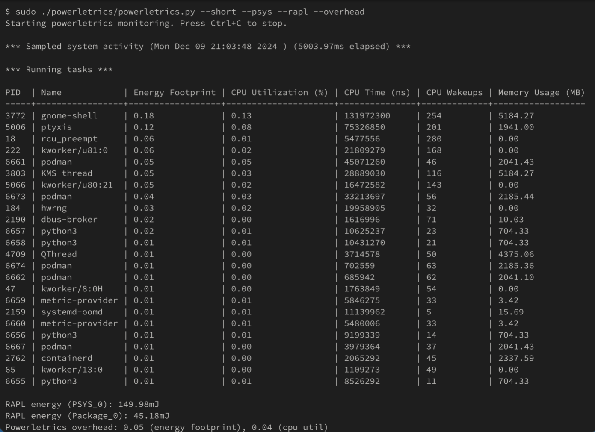

# powermetrics on 🐧 so powerletrics

This project tries to copy the powermetrics program under mac but brings the functionality to Linux.
This is still very early on in development. Please test and submit an issue.

## Install and run

You need to install bcc on your system which should include all the python bindings

https://github.com/iovisor/bcc/blob/master/INSTALL.md

You can then run the program from the shell with sudo
```
sudo python3 powerletrics.py -i 1000 --show-all --ebpf-memory --flush
```

## Screenshot



## Parameters

### `-i` / `--sample-rate`
- **Default**: 5000 (milliseconds)
- **Description**: Specifies the time interval (in milliseconds) between samples. The program will capture data at this interval. For example, a value of 5000ms means data will be collected every 5 seconds.

### `-n` / `--sample-count`
- **Default**: 0 (infinite)
- **Description**: Defines how many samples to take before the program stops. If set to 0, the program will continue to sample indefinitely until manually stopped.

### `-o` / `--output-file`
- **Description**: If specified, the output will be written to the provided file instead of the standard output (console).

### `-r` / `--order`
- **Choices**: `pid`, `wakeups`, `cputime`, `composite`
- **Default**: `composite`
- **Description**: Sets the sorting method for the displayed process list:
  - `pid`: Sort by process ID.
  - `wakeups`: Sort by the number of CPU wakeups.
  - `cputime`: Sort by CPU time.
  - `composite`: Sort by the composite energy impact (a weighted combination of several factors, like CPU, memory, and disk usage).

### `--show-all`
- **Description**: Enables all available samplers and shows all the information from each one. This includes process energy impact, I/O stats, and network stats.

### `--show-process-energy`
- **Description**: Displays an estimated energy impact for each process. This is a rough estimate combining CPU, disk, and network usage. Enabling this flag automatically enables sampling for all the relevant per-process statistics (CPU, I/O, and network).

### `--show-process-io`
- **Description**: Displays per-process I/O statistics, such as disk read and write bytes.

### `--show-process-netstats`
- **Description**: Displays per-process network statistics, including the number of received and transmitted network packets.

### `--format`
- **Choices**: `text`, `plist`
- **Default**: `text`
- **Description**: Specifies the format in which the output will be displayed:
  - `text`: Human-readable text format.
  - `plist`: Property list (XML) format, useful for programmatic analysis.

### `--ebpf-memory`
- **Description**: Enables eBPF memory sampling for gathering memory usage statistics. This offers an alternative way of collecting memory usage via eBPF.

### `--show-command-line`
- **Description**: Displays the full command-line arguments for each process.

### `--flush`
- **Description**: Forces flushing of the output after each print. This is useful when writing output to files or when immediate display is necessary.


## Weights for energy impact

When calculating the energy impact each value is multiplied with a `weight` these are different for each machine. You
can modify them in the `weights.conf` file.

## Tips.

### Terminal wraps because of long command line paramters
Execute this before starting the program

```
tput rmam
```

### Why is the memory value different to the value I see in top
Because we use `Total Virtual Memory` instead of `Resident Set Size`

### Why are there programs that do not show up in the list
Only programs that have run are listed as they are the only ones that have actually used something.

### Why don't you use psutil
Because it does the same things (yes we check) and is slower as it adds more overhead. We still 😍 psutil though